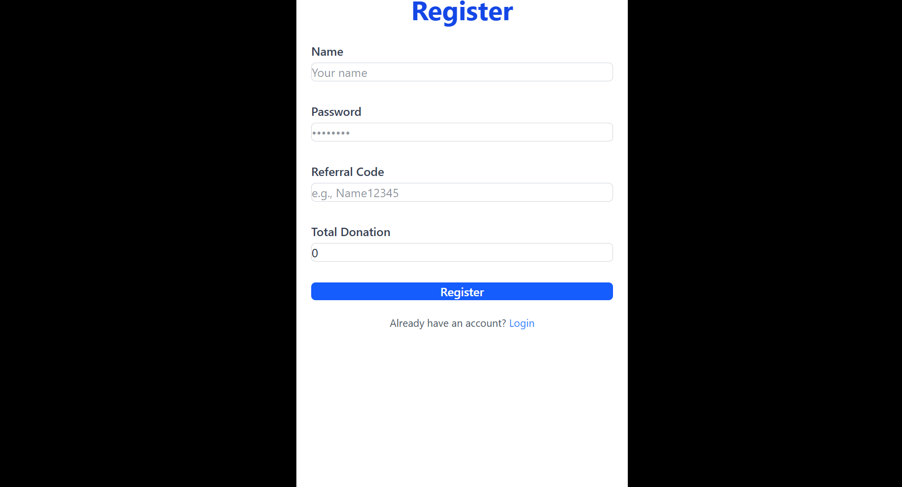
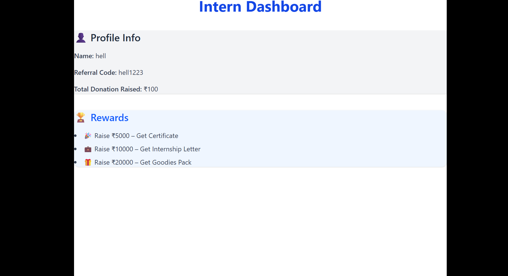
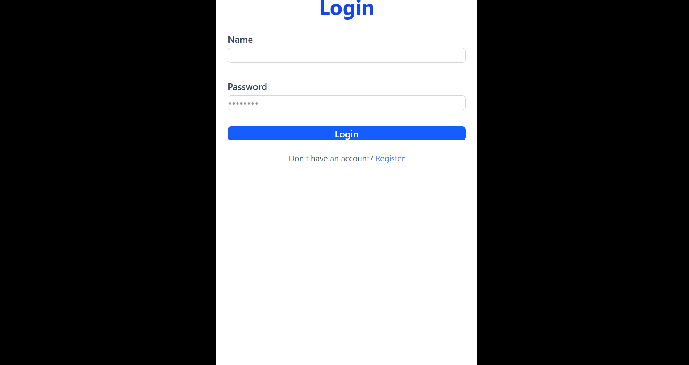

# Fundraising Portal

A comprehensive web application to streamline and manage fundraising activities efficiently. This portal provides a seamless experience for both fundraisers and donors, enabling organizations to track campaigns, process donations, and access real-time analytics.

> **Note:** This repository is an assignment project for an internship.

---

## 🗂️ Project Structure

```
-fundraising-portal/
│
├── backend/      # Express.js backend API
└── frontendfundraising-portal/     # Frontend client 
    
```

---

## 🚀 Features (Assignment Requirements)

### Frontend

1. **Login & Signup Pages**
   - Simple, dummy login and signup forms.
   - No authentication required; forms do not need to be connected to backend.

2. **Dashboard**
   - Displays the following information:
     - Intern name (from dummy backend)
     - Dummy referral code (from dummy backend)
     - Total donation raised (just a number, fetched from backend)
   - **Rewards/Unlockables Section**
     - Static display of badges, rewards, or unlockable items.

### Backend

1. **REST API / MongoDB Setup**
   - Simple Express.js server.
   - Endpoints return dummy data for:
     - Username
     - Referral code
     - Amount raised
   - Data is fetched from MongoDB.

2. **Testing**
   - API can be tested using Postman.
   - No authentication or authorization required.

---

## 🖼️ Images

Below are some screenshots of the application.  
*(Screenshots are located in `frontend/public/`)*

| Register Page | Dashboard | Login Page |
|---------------|-----------|------------|
|  |  |  |

> _If your images have different names, update the links above accordingly._

---

## 🛠️ Technologies Used

### Backend
- **Node.js** & **Express.js**
- **MongoDB** with **Mongoose**
- **dotenv** for environment configuration
- **cors** for cross-origin requests

### Frontend
- **Vite.js** & **tailwind css**

---

## 📦 Installation & Setup

### 1. Clone the repository

```bash
git clone https://github.com/shivp0404/-fundraising-portal.git
cd -fundraising-portal
```

---

### 2. Backend Setup

```bash
cd backend
npm install
```

#### **Backend Prerequisites**
- Node.js & npm installed

#### **Install required npm packages**
```bash
npm i dotenv cors express mongoose
```

#### **Environment Variables**
- Create a `.env` file in the `backend` folder with the following content:
  ```
  DB_LINK="your_mongoose_connection_string"
  ```

#### **Running the Backend**
```bash
# For development (with nodemon)
npm run dev
```

---

### 3. Frontend Setup

```bash
cd ../frontendfundraising-portal
npm install
```

#### **Running the Frontend**
```bash
npm run dev
```

---

## 💡 Usage

- Register or log in as a user (dummy, no actual authentication).
- View dashboard for intern details, referral code, and total donations.
- Explore the static rewards/unlockables section.
- (Bonus) View the leaderboard page for top fundraisers.

---

## 🤝 Contributing

Contributions are welcome! Please open an issue or submit a pull request for any improvements or bug fixes.

---

## 📄 License

[Specify your license here, e.g., MIT, Apache 2.0, etc.]

---

## 🙏 Acknowledgements

[Optional: Credit libraries, tools, or individuals that helped with the project.]

---

> For questions or support, contact [shivp0404](https://github.com/shivp0404).
